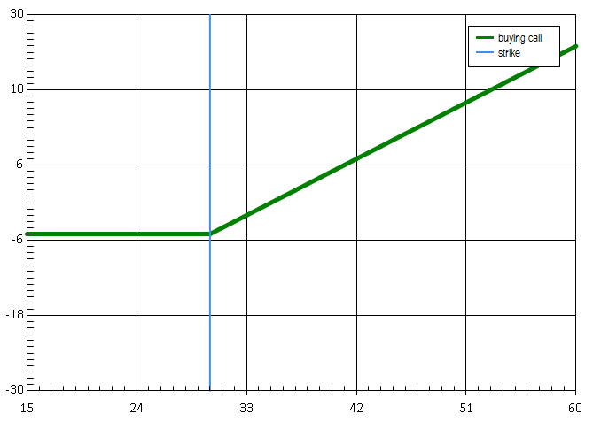
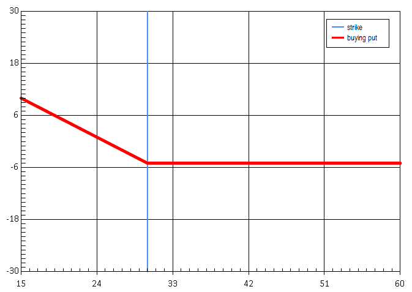
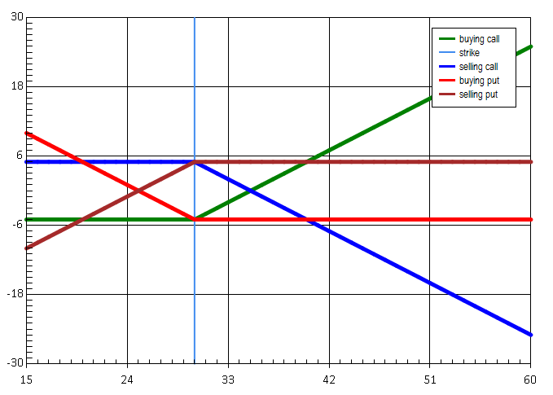
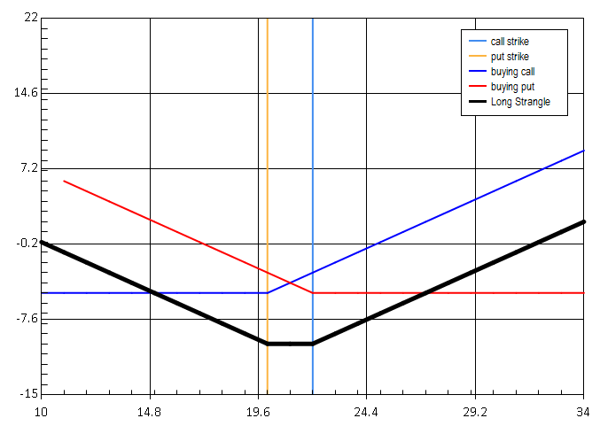
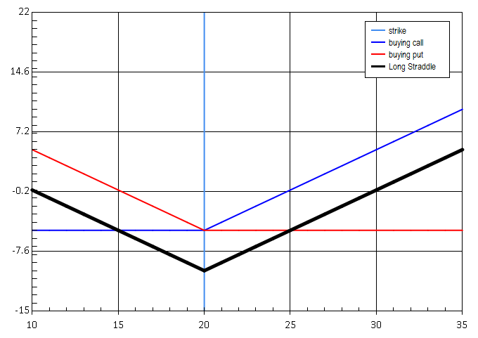
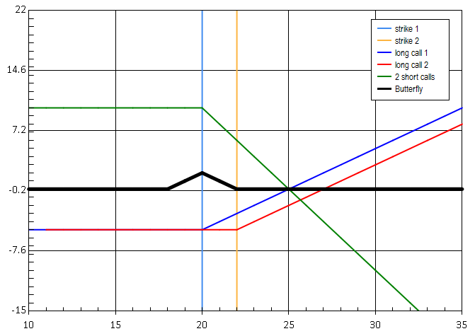
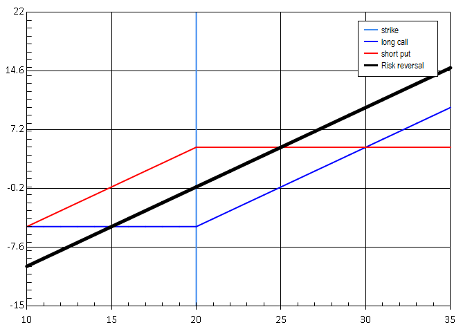
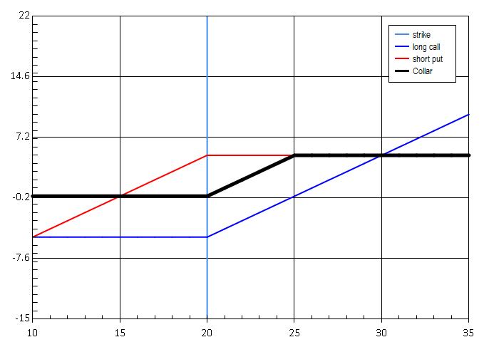
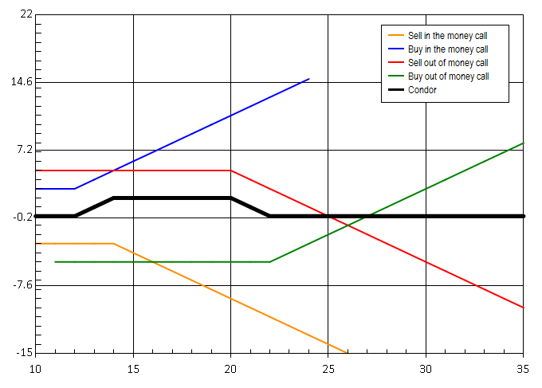
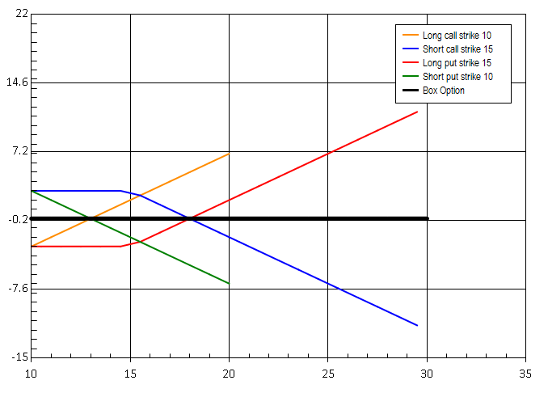

When I started to work for my current company, I have struggled to get one simple overview of this universe. Instead I had to consult many sources, lot of them were going deep into details of one particular financial product. An I was not and still I am not interested in details of investment banking but just needed simple overview.

Over the time I took notes, and kept them for myself, getting information mostly from wikipedia or investopedia. I have also wrote some F# code to generate payoff charts for arbitrary options, which are used bellow:

The world of derivative products is not that complicated. From my (developer's point of view) understanding the basics of derivatives is easy. The finance guys make it bit more complicated by using special vocabulary. For instance selling and option might be called "writing an option". The price of the stock at the time that the broker and the investor exchange the option might be called "Final Reference" or "Spot Price" and so on.
You might also understand a product (such as future) but you might get confused by the way it is priced – that is the way that the brokers and investors agree on prices (percentage, basis points, spreads).

Content
=======
-   [Basic vocabulary and terms](#vocabulary-and-terms)
-   [Financial instruments](#financial-instruments)
-   [Financial derivatives](#derivatives)
    -   [Options](#options)
        -   [Call Option](#call)
        -   [Put Option](#put)
        -   [Delta, Implied Volatility](#deltaImpliedVol)
        -   [Strategies](#strategies)
        -   [Options and Hedging](#optionsHedging)
        -   [Barrier Options](#barrierOptions)
        -   [Warrants](#warrants)
        -   [Options pricing](#pricing)
    -   [Futures and Forwards](#futfwd)
        -   [Futures and Forward pricing](#futPricing)
        -   [Futures and Forward rolls](#futRolls)
    -   [Convertible Bonds and Reverse Convertibles](#bondStuff)
        -   [Convertible Bonds](#convertibleBonds)
        -   [Reverse Convertibles](#reverseConvertibles)
    -   [Swaps](#swaps)
        -   [Volatility and Variance Swaps](#varSwaps)
        -   [Total Return Swaps](#trs)
    -   [ETFs](#etfs)
        -   [Net Asset Value](#nav)
        -   [Creation Redemption](#creationRedemption)
    -   [Other Crazy Stuff](otherStuff)
        -   [Autocallables](autocallables)
        -   [Program Trading](programTrading)

Vocabulary and terms 
====================

There are two entities in this business:

-   **Asset Manager** - a company which has collected large amount of
    money and invests this money hoping in regular profit. Asset Manager
    can be also called **Buy Side**, because historically and probably
    still he buys more, but he sells as well. So a buy side can be
    pension fund, mutual fund a big private equity or a hedge fund – in
    general anyone with enough money.
-   **Broker** - usually a bank. It is the one that gives to Asset
    Managers what they need. That is the access to the shares and they
    also create the derivative products that the buy side can use either
    to risk or to hedge himself while buying some shares. Brokers are
    called **Sell Side** as well, because they sell more than buy, even
    though, they do both (as well as Asset Managers).

**Underlying** - underlying is anything that you can buy. Usually shares
(stocks) or commodities but in some circumstances and underlying can be
also a future. The idea is that it “underlies” the derivatives product.
For instance you can buy an option on stock of Google. In that case the
stock of Google is the underlying. The derivatives are products that are
derived from the underlying. An option gives you the right to buy the
underlying at some time in the future. A forward will oblige you to buy
a stock at the price that you have agreed at some point in the future. A
swap will obligate to exchange the underlying for something else. You
could create an agreement to swap at some point 200 shares of Google
stocks for 1000 liters of beer. This kind of swap would be a derivative
with 2 underlyings (shares of google and beer).

**Short** - means to sell, shorting something means selling that given
underlying.

**Long** - means to buy, being long in something means to buy and
underlying and keep it.

Financial instruments 
=====================

Financial instruments are anything that you can trade on the markets.
Derivatives as such as one category of financial instruments but unlike
the basic once, they are "made of" them.

-   **Equities** - stocks, shares
-   **Debt** - bonds or mortages. This products are also called **Fixed
    Income** products, because the borrower or issuer aggree on regular
    payments
-   **FX - Currencies and Rates**
-   **Commodities** - oil, gold, whatever. Not really Financial
    Instrument, but you can trade it and the derivatives can be based on
    these as well
-   **Derivatives** - further described in this article. Products
    derived from all of the other once with additional conditions and
    rules

Financial Derivatives 
=====================

This list of financial derivatives is definitely not complete and it is
just a try for some logical segregation (which can be sometimes quite
hard in this field)

-   **Options and stratgies** - Options give the right to buy or sell
    and are a basic building block. Two or more options in the same time
    form strategies, which give interesting exposures.
-   **Forwards and Futures** - the obligation to buy something in the
    future for fixed price.
-   **Convertible Bonds** - enable the change of a bond into stock
-   **Swaps** Variance, Volatility or Return Swaps - basically
    exchanging performance or volatility of one stock for other stock's
-   **ETFs** - Exchange-Traded Fund. Can be seen as a stock composed of
    other stocks
-   Others: Autocallables, Accumulators, Program Trading and many other
    magic stuff

Options 
-------

There are two basic types of Options: **CALL** which gives the owner the
right to buy and **PUT** giving the owner the right to sell. These two
basic types can then be composed to form a "strategy". **Strategy** is
just a fancy world used for buying or selling two options at the same
time. As you can see later one can choose to do that for multiple
reasons.

### Call Option 

Call is the right, but not the obligation to buy given underlying (stock
or commodity) at given price until given date.

A trader who believes that stock's price will increase can buy the right
to purchase the stock (he buys call option) at a fixed price, rather
than just purchase the stock itself. He would have no obligation to buy
the stock, only the right to do so until the expiration date. The price
that he will pay for that option is called Premium. If the stock price
at expiration (also called Spot Price) is above the agreed price (also
called Strike) by more than the premium paid, he will profit i.e. if
S&gt;X, the deal is profitable. If the stock price at expiration is
lower than the exercise price, he will let the call contract expire
worthless, and only lose the amount of the premium. The option is less
expensive than the shares itself. For less money the trader can control
larger number of shares. That is why we talk about leverage.

**Options parameters:**

-   **Premium** - the priced paid for the option
-   **Strike** - the agreed price at which the underlying will be bought
-   **Expiry date (maturity)** - the date at which the option expiries
    (until when you can use it)
-   **Settlement**- either the real underlying is exchanged at
    expiration date ("Physical") or money is exchanged in place of the
    underlying ("Cash").

To visualize the options and other derivatives one can use the pay-off charts. On the X-axes of the charts we have the price of the underlying (commodity or stock) and on the Y-axes we have the total profit.

### Put option

Put option gives the owner the right to sell the stock for given strike price, otherwise all other parameters are the same.

A trader who believes that a stock's price will decrease can buy the
right to sell the stock at Strike price. He will be under no obligation
to sell the stock, but has the right to do so until the expiration date.
Logically the one who sold him the option will have buy the stock from
him (if at some point the option will really get used) If the stock
price at expiration is below the exercise price by more than the premium
paid, he will profit. If the stock price at expiration is above the
exercise price, he will let the put contract expire worthless and only
lose the premium paid. Again here are the 2 pay off chats. If you bought
a PUT for a MSFT stock with strike 100 for 10 dollars, you bought
yourself the right to sell MSFT stock for 100 dollars. Now if the price
is 90, you didn't lose anything but did not get anything either. On the
other hand if the price did not move and it is still 100, you lost your
10 dollars. That shall be clear from the pay-off chart.

One has to understand, one the market one can buy or sell both types CALLs and PUTs. The outcome of each operation is different. The
following chart, shows all 4 operations that can be done.

### Delta and Implied Volatility

Delta always and implied volatility sometimes are parameters that the
brokers provide with the price of the option, when they want to sell you
one.

Delta expresses in percent the change in the price of the option with
respect to change in price of the underlying. That is how much will the
option price change if the underlying stock moves up or down. Delta is
one of the so called [Greeks](#greeks) that are briefly discussed later.
Delta is expressed in percentage. If a stock costs 10\$ and an option
(with some maturity) is selled for 5 dollars and the Delta of the option
is 50%, then if the stock goes to 11\$, the option will go to 5.5%. That
is called a delta adjustment. The broker at some point proposes a price
to the investor and provides the delta as well. If the investor buys in
next hour, he knows what the price of the option will be at the deal
time.

Delta is always positive for a CALL and negative for a PUT. If a price
of the underlying goes down, then the price you pay for the right to
sell such share on some fixed price goes up. If the price of the
underlying falls from 10 to 1, and you had an option giving you the
right to sell for 5, you are lucky since, since you will be selling much
above the market. It's clear that price of such option goes up. The
reverse is true for the call. If the price of the underlying goes from
10 to 15, and you wanted to buy an option with strike 12. The broker was
willing to sell you such option for 11 before, but it's price went
definitely up.

**Implied Volatility** is another parameter sometimes provided by the
brokers when giving the prices. In order to provide the price for any
given option, the broker estimates the volatility of the market in the
future. Implied Volatility is such estimation. Options are priced by
using different variations of Black Sholes furmula. The basic idea
behind this formula states, that the price of an option does depend only
on it's parameters, current price of the option and the estimated
volatility of the market. Of course when a broker gives a price of an
option, the price will depend also on other factors, such as whether the
broker has any shares of the given underlying already. But in theory,
the broker could just provide the estimated volatility that he puts into
his model and that is enought to calculate the price.

### Options trading and hedging against delta adjustment

When a trader wants to obtain an option, he will specify the parameters
and ask brokers whether they can give him such contract. The broker will
give to the trader the price for such contract and also the delta. That
is the rate at which the contract price will change with respect to the
change in the underlying.

If the contract is big enough, the broker might need some time to
acquire enough shares. Also the buyer might take some time to decide
whether to buy or not. So after all this delay, the price of the option
contract has changed by delta\*(underlying price change). The buyer
might have lost money.

To evict such situation, options hedging is used. In this situation, the
broker will buy from the buyer of the option such amount of shares of
the given underlying, so the change of the price of the option contract
will be completely mitigated by this operation.

### Strategies based on options

Calls and Puts can be bought or selled in the same time with diferent
parameters. This results in diferent pay-offs of such operations. Buying
or selling multiple options at the same time in the same contract is
called buying a "Strategy". Here is probably non-complete list of
strategies:

-   [Call spread and Put Spread](#callSpread)
-   [Strangle](#strangle)
-   [Straddle](#straddle)
-   [Butterfly](#butterfly)
-   [Risk Reversal](#riskReversal)
-   [Collar](#collar)
-   Condor
-   [Box Option](#boxOption)

#### Call spread

This strategy consists of two calls with the same expiry. The first one
with smaller strike is sold and other with higher strike is bought.

The payoff is shown bellow. Call spread behaves liked to underlying, but
the maximum profit and maximum loss values are limited by the strike
prices of the calls.

Analogically to call spread, put spread is a strategy composed of two
put options, with the same expiries and different strikes.

#### Strangle

Strangle allows the holder to profit based on how much the price of the
underlying security moves, with relatively minimal exposure to the
direction of price movement. Long stangle is composed of long call and
long put, with same expiries. The profit potential is unlimited, the
strategy may be used in volatile markets.

Short strangle is composed of short put and short call with same
expiries and it is profitable if the price of the underlying does not
move much and the profit is limitted to the premiums obtained, otherwise
the potential loss is unlimited.

#### Straddle

Very similar to strangle, Long Straddle is a long call with a long put,
with same strikes and expiries.

Strategy involving the purchase or sale of particular option derivatives
that allows the holder to profit based on how much the price of the
underlying security moves, regardless of the direction of price
movement. Long straddle = long call option + long put option – same
strike and expiry. As for strangle, this strategy might be usefull in
highly volatile markets.

Again Short straddle is like short strangle, but strike is the same. The
price has to stay very close to the strike for a profit based on
premiums.

#### Butterfly

Limited risk, non-directional options strategy that is designed to have a large probability of earning a limited profit when the future volatility of the underlying asset is expected to be lower than the implied volatility.

#### Risk reversal

Selling an out of money put and buy out of money call with same
maturity. An investor wants to go long in the underlying but instead of
going long on the stock, he will buy an out of the money call option,
and simultaneously sell an out of the money put option. Presumably he
will use the money from the sale of the put option to purchase the call
option. Then as the stock goes up in price, the call option will be
worth more, and the put option will be worth less. If an investor holds
the underlying and sells a risk reversal, then he has a collar position.

The pay-off is exactly the same us holding the underlying stock. One
could use risk reversal to speculate on a stock without holding the
stock.

#### Collar
-   Long the underlying
-   Long a put option at strike price X (called the "floor")
-   Short a call option at strike price (X+a) (called the "cap")

Latter two are a short Risk reversal position,so we can say Underlying - Risk reversal = Collar. The profit or loss on underlying are very limited.

The premium income from selling the call reduces the cost of purchasing the put.

#### Condor

Strategy with limited risk, non-directional (the same result if underlying moves either way) with limited profit when the underlying security is perceived to have little volatility.

-   Sell 1 In The Money Call
-   Buy 1 In The Money Call (Lower Strike)
-   Sell 1 Out of The Money CALL
-   Buy 1 Out of The Money CALL (Higher Strike)

Maximum profit for the long condor option strategy is achieved when the
stock price falls between the 2 middle strikes at expiration. It can be
derived that the maximum profit is equal to the difference in strike
prices of the 2 lower striking calls less the initial debit taken to
enter the trade.

#### Box option

Combination of 4 basic legs, that achieves neutral interest rate position - riskless payoff.

-   Long call strike 10
-   Short call strike 15
-   Long put strike 15
-   Short put strike 10

The strategy has constant payoff, in ideal case the net premium paid for
the strategy should be equal to the payoff. However the comission will
reduce the profitability to nothing. Might be seen as a form of lending
money on markets.

### Barrier options

TODO!!!

### Warrants

Warrants have the same parameters and behave just like options. There
are few differences:

-   They are not publicly traded, not listed, like OTC options.
-   The expiration period is usually in years.
-   Once the warrant is exercised the new outstanding shares of company
    are created. In case of options, no new shares are issued, the
    writer of the option has to buy them on the market.
-   -   Often used as alternative to employees stock options.

### Specifying option and it's price

This part is not about the actual pricing of options, that is
determining the price. This is more about how options are exchanged on
the market, in what units the prices as exchanged.

-   Fixed price per contract
-   In percentage
-   Spread between legs
-   Pricing by strike
-   Total premium for multilegs

Forwards & Futures 
------------------

By buying a forward or future, you have the right but also the
obligation to buy given underlying at the selected price. Both are part
of **Delta One** products. Since the price of the future moves the same
way as the price of the underlying. Futeres unlikely to forwards are
listed, standardized contracts. That means they can be bought on an
exchange. Forwards are pure OTC products - not standardized at all.

Futures or Forwards have the same parameters as options, though in the
majority of cases, no strike is specified. That is because the price at
which the underlying will be exchanged at the expiration date, is
defined solely by the market. Typically futures prices are listed on the
market. For instance the current price of SPX Indice might be 2000 and
the future which expires next month might be at 2050.

### Pricing of futures

Futures are delta-one derivatives. The price of the future changes hand
in hand with the price of the underlying (if the stock goes up one
dolar, the future on the same stock in 3 months will go up as well by
one dollar). That affects the way that futures are priced. Since
typically the future price is always specicied with respect to the
current stock price, there are 2 common ways of pricing futures:

-   Net Basis - the difference between stock price and future price is
    given by the broker in basis points.
-   In Percentage - the future price is given as the percentage of
    current price. For bullish stock that will be greater than 100% and
    for bearish stocks that will be lower than 100%.

### Future and Forward Rolls

Rolls enable the holder of given future to keep the position in the
underlying when his future is about to expire.

Convertible Bonds, Reverse Convertible Bonds {#bondStuff}
--------------------------------------------

These two derivatives at some point allow or force the holder to convert
bonds into shares.

### Convertible Bonds

Convertible Bond is a contract which allows the conversion of listed
corporate bonds into the underlying equity. This is available only on
listed companies that issue as well bonds to finance their operations.
Converts are listed on exchanges. The companies issue the CBs just like
the bonds the are underlying the converts.

From certain point of view, CB can be seen as an option, because if
underlying stock behaves achieves certain performance, the owner will
become the proprietary of the stock, if not, he will keep the bonds with
regular return. For that reason, it makes sense to provide Delta while
pricing Convertible Bonds, since the price of the CB will move with
respect to the underlying share.

Convertible bond thus has the power of option and can be leveraged to
obtain the underlying equity. It will be however more expensive than
CALL option becase one pays for the bond as well.

### Reverse Convertibles

Holder of a Reverse convertible is regulary paid a coupon as if he would
be holding a standard bond. On the upside if the shares of the
underlying company (and that can be any company, not just the issuer of
the original bonds) fall bellow certain PUT like Strike. His bonds will
convert into the stocks of this company

Swaps 
-----

Swaps as the name suggest are contracts that specify an exchange between
the buyer and the seller of the contract. There are various types,
depending on what is exchanged: Commodity, Interest Rate, Volatility or
Variance.

### Variance and Volatility Swaps

Volatility measures the magnitude of movements for given stock. Standard
deviation is used to express the volatility of the stock. Variance is
the square of standard deviation, so in a sense just amplified
volatility.

Volatility or Variance swap allow the investor to bet on the volatility.
The investor specifies a volatility level which he expects (striked
volatility) and if the volatility goes over this level, he gets paid a
bigger payoff. The payoff is specified as:

    PayOff = VegaAmount (RealVolatility – Volatility Striked)/ RealVolatility

The bigger the difference between the Real Volatility and the Striked
volatility is, more money does the buyer of such swap gets. The whole
amount is multiplied by a multiplier called "Vega Amount". Vega is on of
the greeks which meassures the sensitivity of an option to the change in
the volatility of the option. There is however no connection here. It's
just the term used on the markets for this multiplier.

### Total Return Swaps

TRS allows the buyer to exchange the performance of certain stock for
the performance of standard interest rate. The buyer can for instance
bet on the performance of certain underlying (eg. MSFT stock) against a
standard interest rate for standard period. For instance Euribor 6M is
the interest rate provided by ECB (European Central Bank) for next 6M.
That might be 2% fo example. The buyer believes that MSFT will beat that
and asks the seller to pay him the difference if that is the case. The
seller, for certain comission will do that. That allows the asset
manager to bet on performance without owning the underlying shares.

ETFs 
----

Exchange Traded Funds are compositions of stocks, that usually track an
index or a sector. They are listed and traded like regular stocks. They
companies that emit ETFs thus enable the asset managers to invest into
whole sectors or regions, without the need of knowing the details of the
markets.

### Net Asset Value

Common to all funds which invest into stocks. At the end of the day the
NAV of the fund is calculated as the sum of all the stocks own by the
fund, divided by the number of shares.

ETFs however are listed themselves and traded on the market so beside
the NAV they also have the market value. Their market value can be
bellow or over the NAV.

Settlement date

The date when you need to the money to buy your ETF or when you will
receive the money for selling. For ETFs it is 3 days after the deal (for
some traditional reasons, I suppose).

### Creation Redemption

**Creation** is the process of emission of ETF shares. ETF is supposed
to track a sector or index and has exact composition. The company
issuing ETFs needs to aquire the stocks that form the ETF to emit it.
Since one share of ETF has exact composition, the issuer needs to aquire
that exact amount to be able to sell that one share of ETF with certain
comission.

**Redemption** is the reverse process. The issuer will buy the ETFs from
the owners and give them back the underlying shares, or equal amount in
cash.

This process is essential and allows the ETF to always trade around it's
NAV. If the demand fo some ETFs (eg. ETF mirroring Asian construction
market) would be too high, the prices would go up too much and get too
far away from the real prices of the shares of the mirrored companies.
The issuer can in that case emit more shares of the ETF. On the other
hand if investors start to sell certain ETF too much and don't believe
in the sector, the redemption process can reduce the quantity of the
ETFs and stabilize the price which would go down too much otherwise.

Other crazy stuff {#otherStuff}
-----------------

### Autocallables

TODO!!!

### Program Trading

An asset manager might interested in investing in sectors or countries,
not exact shares. ETFs are one way to get there, Program Trading might
be the other way. PT are basket trades (buying multiple underlyings in
same time) and are very big in size, the buyer specifies the total
amount of the traded volume (total notional) and might provide also the
number of stock he wants to buy in the future. Then he gives multiple
characteristics such as the percentage per country or sector. For
instance 10% in US, 30% in UK and 25% in Telecom, 50% in services and so
own. He also asks certain parameters such as how much this composition
should track some index. This is done usually by setting the
[Beta](#beta) in percent versus some index like SPX. The seller of such
contract than provides price and some (huge) commission.

The investor will do such a trade when he wants to invest big amount of
money in the same time to multiple markets. Usually the trade
composition is determined by dedicated software, hence "Program
Trading".